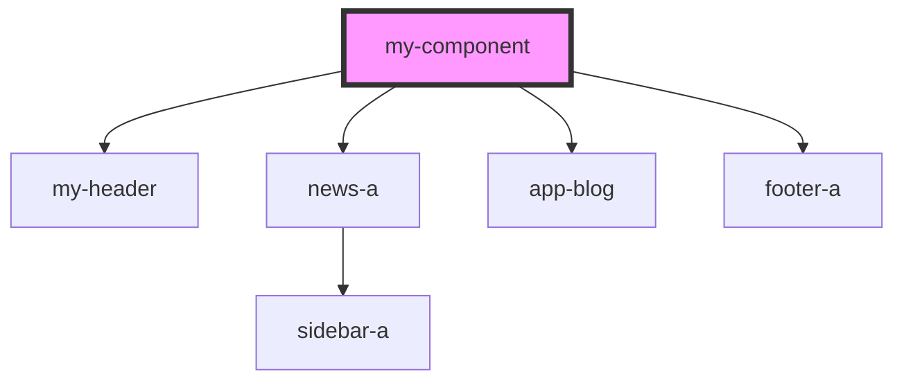

# my-component

<!-- Auto Generated Below -->

## Properties

| Property | Attribute | Description     | Type     | Default     |
| -------- | --------- | --------------- | -------- | ----------- |
| `first`  | `first`   | The first name  | `string` | `undefined` |
| `middle` | `middle`  | The middle name | `string` | `undefined` |

## Dependencies

### Depends on

- [my-header](../res/view/my-header)
- [news-a](../theme-one/res/view/news-a)
- [app-blog](../theme-two/res/view/app-blog)
- [footer-a](../res/view/footer-a)

### Graph

----------------------------------------------

*Built with [StencilJS](https://stenciljs.com/)*
