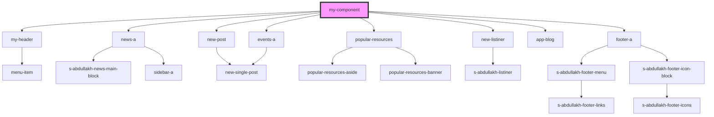

# my-component

<!-- Auto Generated Below -->

## Dependencies

### Depends on

- [my-header](../res/view/my-header)
- [news-a](../theme-one/res/view/news-a)
- [new-post](../res/view/new-post)
- [popular-resources](../theme-one/res/view/popular-resources)
- [events-a](../theme-one/res/view/events-a)
- [new-listiner](../res/view/new-listiner)
- [app-blog](../theme-two/res/view/app-blog)
- [footer-a](../res/view/footer-a)

### Graph

----------------------------------------------

*Built with [StencilJS](https://stenciljs.com/)*
