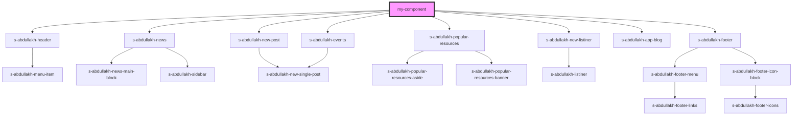

# my-component

<!-- Auto Generated Below -->

## Dependencies

### Depends on

- [s-abdullakh-header](../res/view/s-abdullakh-header)
- [s-abdullakh-news](../theme-one/res/view/s-abdullakh-news)
- [s-abdullakh-new-post](../res/view/s-abdullakh-new-post)
- [s-abdullakh-popular-resources](../theme-one/res/view/s-abdullakh-popular-resources)
- [s-abdullakh-events](../theme-one/res/view/s-abdullakh-events)
- [s-abdullakh-new-listiner](../res/view/s-abdullakh-new-listiner)
- [s-abdullakh-app-blog](../theme-two/res/view/s-abdullakh-app-blog)
- [s-abdullakh-footer](../res/view/s-abdullakh-footer)

### Graph

----------------------------------------------

*Built with [StencilJS](https://stenciljs.com/)*
