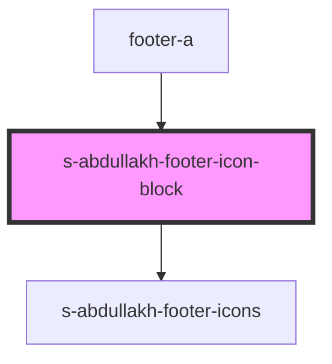

# s-abdullakh-footer-icon-block

<!-- Auto Generated Below -->

## Properties

| Property | Attribute | Description | Type  | Default     |
| -------- | --------- | ----------- | ----- | ----------- |
| `arr`    | `arr`     |             | `any` | `undefined` |

## Events

| Event           | Description | Type               |
| --------------- | ----------- | ------------------ |
| `clickOnFooter` |             | `CustomEvent<any>` |

## Dependencies

### Used by

 - [footer-a](../../..)

### Depends on

- [s-abdullakh-footer-icons](./res/view/s-abdullakh-footer-icons)

### Graph

----------------------------------------------

*Built with [StencilJS](https://stenciljs.com/)*
