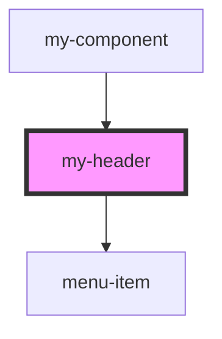

# my-header

<!-- Auto Generated Below -->

## Properties

| Property        | Attribute        | Description                    | Type                  | Default     |
| --------------- | ---------------- | ------------------------------ | --------------------- | ----------- |
| `logoUrl`       | `logo-url`       | ссылка на изображение логотипа | `string`              | `undefined` |
| `menu`          | --               | массив меню                    | `AbdullakhMyHeader[]` | `[]`        |
| `subscribeText` | `subscribe-text` | ссылка на изображение логотипа | `string`              | `undefined` |
| `theme`         | `theme`          | массив меню                    | `boolean`             | `undefined` |

## Events

| Event                | Description          | Type               |
| -------------------- | -------------------- | ------------------ |
| `clickOnHeader`      | клик по логотипу     | `CustomEvent<any>` |
| `clickOnSwitchTheme` | клик по Switch Theme | `CustomEvent<any>` |
| `clickOnTheme`       | клик по логотипу     | `CustomEvent<any>` |

## Dependencies

### Used by

 - [my-component](../../../my-component)

### Depends on

- [menu-item](./res/view)

### Graph

----------------------------------------------

*Built with [StencilJS](https://stenciljs.com/)*
