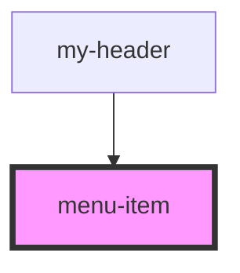

# menu-item

<!-- Auto Generated Below -->

## Properties

| Property | Attribute | Description | Type  | Default     |
| -------- | --------- | ----------- | ----- | ----------- |
| `arr`    | `arr`     | массив меню | `any` | `undefined` |

## Events

| Event           | Description              | Type               |
| --------------- | ------------------------ | ------------------ |
| `clickOnHeader` | клик по конкретному меню | `CustomEvent<any>` |

## Dependencies

### Used by

 - [my-header](../..)

### Graph

----------------------------------------------

*Built with [StencilJS](https://stenciljs.com/)*
