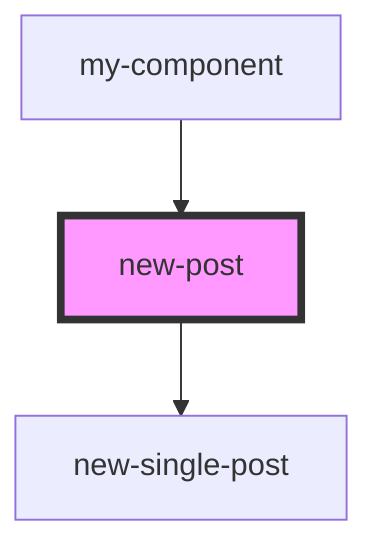

# new-post

<!-- Auto Generated Below -->

## Properties

| Property       | Attribute        | Description     | Type     | Default     |
| -------------- | ---------------- | --------------- | -------- | ----------- |
| `newPost`      | --               | массив newsPost | `any[]`  | `undefined` |
| `newPostTitle` | `new-post-title` | текст заголовка | `string` | `undefined` |

## Events

| Event                  | Description                        | Type               |
| ---------------------- | ---------------------------------- | ------------------ |
| `clickNewPost`         | клик по в компоненте NewPost       | `CustomEvent<any>` |
| `clickOnNewSinglePost` | клик по в компоненте NewSinglePost | `CustomEvent<any>` |

## Dependencies

### Used by

 - [my-component](../../../my-component)

### Depends on

- [new-single-post](../new-single-post)

### Graph

----------------------------------------------

*Built with [StencilJS](https://stenciljs.com/)*
