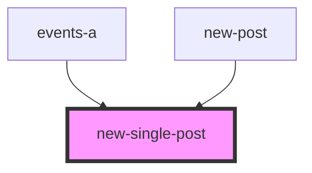

# new-single-post

<!-- Auto Generated Below -->

## Properties

| Property | Attribute | Description                              | Type  | Default     |
| -------- | --------- | ---------------------------------------- | ----- | ----------- |
| `arr`    | `arr`     | массив блоков в компоненте newSinglePost | `any` | `undefined` |

## Events

| Event                  | Description                        | Type               |
| ---------------------- | ---------------------------------- | ------------------ |
| `clickOnNewSinglePost` | клик по в компоненте NewSinglePost | `CustomEvent<any>` |

## Dependencies

### Used by

 - [events-a](../../../theme-one/res/view/events-a)
 - [new-post](../new-post)

### Graph

----------------------------------------------

*Built with [StencilJS](https://stenciljs.com/)*
