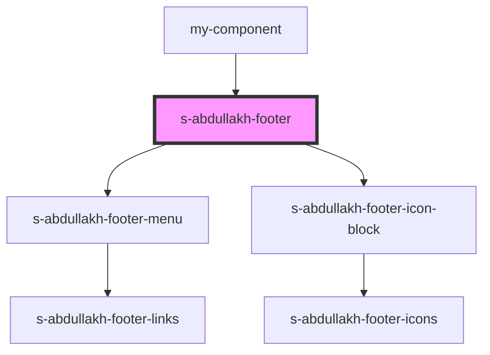

# footer-a

<!-- Auto Generated Below -->

## Properties

| Property | Attribute | Description                          | Type  | Default     |
| -------- | --------- | ------------------------------------ | ----- | ----------- |
| `footer` | `footer`  | массив для вывода компонентов footer | `any` | `undefined` |

## Events

| Event           | Description                 | Type               |
| --------------- | --------------------------- | ------------------ |
| `clickOnFooter` | клик по в компоненте footer | `CustomEvent<any>` |

## Dependencies

### Used by

 - [my-component](../../../my-component)

### Depends on

- [s-abdullakh-footer-menu](./res/view/s-abdullakh-footer-menu)
- [s-abdullakh-footer-icon-block](./res/view/s-abdullakh-footer-icon-block)

### Graph

----------------------------------------------

*Built with [StencilJS](https://stenciljs.com/)*
