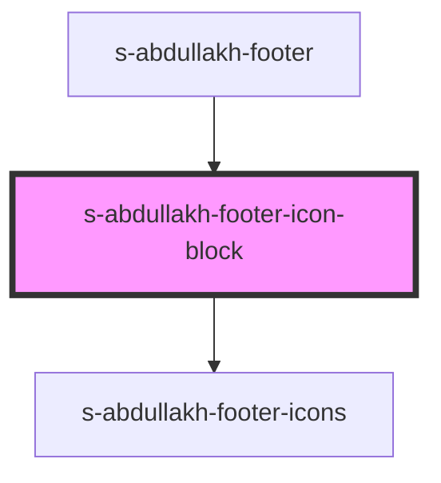

# s-abdullakh-footer-icon-block

<!-- Auto Generated Below -->

## Properties

| Property | Attribute | Description                          | Type  | Default     |
| -------- | --------- | ------------------------------------ | ----- | ----------- |
| `arr`    | `arr`     | массив для вывода компонентов footer | `any` | `undefined` |

## Events

| Event           | Description                 | Type               |
| --------------- | --------------------------- | ------------------ |
| `clickOnFooter` | клик по в компоненте footer | `CustomEvent<any>` |

## Dependencies

### Used by

 - [s-abdullakh-footer](../../..)

### Depends on

- [s-abdullakh-footer-icons](./res/view/s-abdullakh-footer-icons)

### Graph

----------------------------------------------

*Built with [StencilJS](https://stenciljs.com/)*
