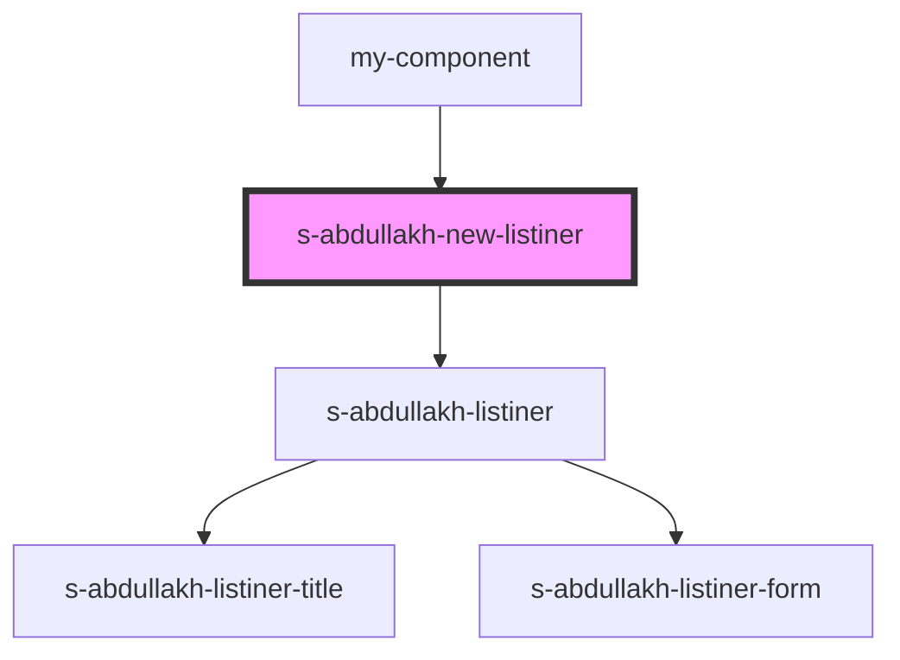

# new-listiner

<!-- Auto Generated Below -->

## Properties

| Property     | Attribute | Description | Type    | Default     |
| ------------ | --------- | ----------- | ------- | ----------- |
| `newlistner` | --        |             | `any[]` | `undefined` |

## Events

| Event             | Description     | Type               |
| ----------------- | --------------- | ------------------ |
| `clickOnListiner` | клик в Listiner | `CustomEvent<any>` |

## Dependencies

### Used by

 - [my-component](../../../my-component)

### Depends on

- [s-abdullakh-listiner](./res/view/s-abdullakh-listiner)

### Graph

----------------------------------------------

*Built with [StencilJS](https://stenciljs.com/)*
