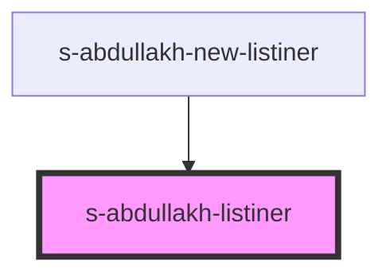

# s-abdullakh-listiner

<!-- Auto Generated Below -->

## Properties

| Property | Attribute | Description     | Type  | Default     |
| -------- | --------- | --------------- | ----- | ----------- |
| `arr`    | `arr`     | массив Listener | `any` | `undefined` |

## Events

| Event             | Description                      | Type               |
| ----------------- | -------------------------------- | ------------------ |
| `clickOnListiner` | клик по кнопке button в Listiner | `CustomEvent<any>` |

## Dependencies

### Used by

 - [s-abdullakh-new-listiner](../../..)

### Graph

----------------------------------------------

*Built with [StencilJS](https://stenciljs.com/)*
