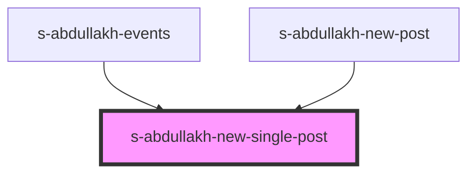

# new-single-post

<!-- Auto Generated Below -->

## Properties

| Property | Attribute | Description                              | Type  | Default     |
| -------- | --------- | ---------------------------------------- | ----- | ----------- |
| `arr`    | `arr`     | массив блоков в компоненте newSinglePost | `any` | `undefined` |

## Events

| Event                  | Description                                  | Type               |
| ---------------------- | -------------------------------------------- | ------------------ |
| `clickOnNewSinglePost` | клик по в компоненте SAbdullakhNewSinglePost | `CustomEvent<any>` |

## Dependencies

### Used by

 - [s-abdullakh-events](../../../theme-one/res/view/s-abdullakh-events)
 - [s-abdullakh-new-post](../s-abdullakh-new-post)

### Graph

----------------------------------------------

*Built with [StencilJS](https://stenciljs.com/)*
