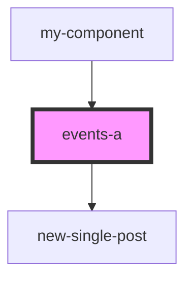

# events-a

<!-- Auto Generated Below -->

## Properties

| Property      | Attribute      | Description                 | Type     | Default     |
| ------------- | -------------- | --------------------------- | -------- | ----------- |
| `events`      | --             | массив компоненту Events    | `any[]`  | `undefined` |
| `eventsTitle` | `events-title` | заголовок компонента Events | `string` | `undefined` |

## Events

| Event                  | Description                                           | Type               |
| ---------------------- | ----------------------------------------------------- | ------------------ |
| `clickOnEvents`        | клик по кнопке Read Report в компоненте newSinglePost | `CustomEvent<any>` |
| `clickOnNewSinglePost` | клик по в компоненте NewSinglePost                    | `CustomEvent<any>` |

## Dependencies

### Used by

 - [my-component](../../../../my-component)

### Depends on

- [new-single-post](../../../../res/view/new-single-post)

### Graph

----------------------------------------------

*Built with [StencilJS](https://stenciljs.com/)*
