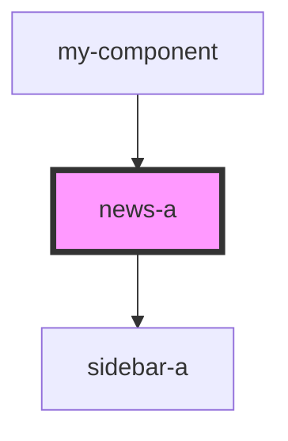

# news-a

<!-- Auto Generated Below -->

## Properties

| Property  | Attribute | Description | Type    | Default     |
| --------- | --------- | ----------- | ------- | ----------- |
| `sidebar` | --        |             | `any[]` | `undefined` |

## Dependencies

### Used by

 - [my-component](../../../../my-component)

### Depends on

- [sidebar-a](res/view/sidebar)

### Graph

----------------------------------------------

*Built with [StencilJS](https://stenciljs.com/)*
