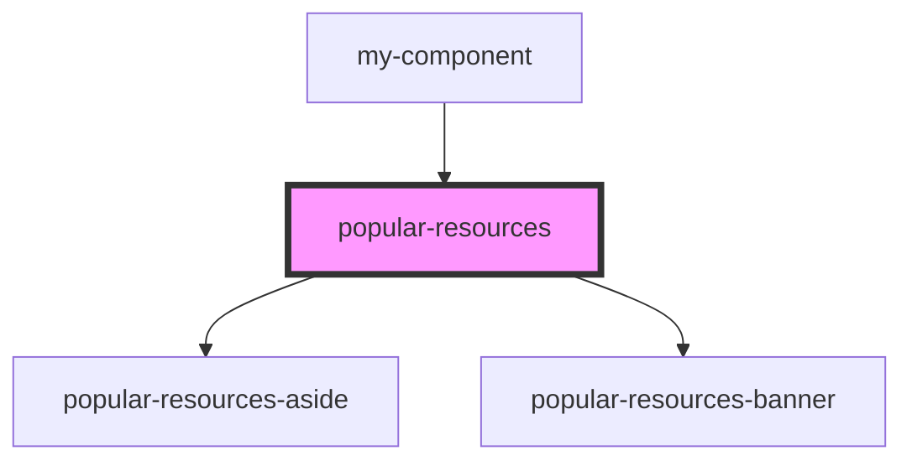

# popular-resources

<!-- Auto Generated Below -->

## Properties

| Property            | Attribute             | Description                                           | Type     | Default     |
| ------------------- | --------------------- | ----------------------------------------------------- | -------- | ----------- |
| `popularAside`      | --                    | массив для блоков компонента popular-resources-aside  | `any[]`  | `undefined` |
| `popularAsideTitle` | `popular-aside-title` | массив для блоков компонента popular-resources-aside  | `string` | `undefined` |
| `popularBanner`     | --                    | массив для блоков компонента popular-resources-banner | `any[]`  | `undefined` |

## Events

| Event            | Description                          | Type               |
| ---------------- | ------------------------------------ | ------------------ |
| `clickOnPopular` | клик по компоненту popular-resources | `CustomEvent<any>` |

## Dependencies

### Used by

 - [my-component](../../../../my-component)

### Depends on

- [popular-resources-aside](./res/view/popular-resources-aside)
- [popular-resources-banner](./res/view/popular-resources-banner)

### Graph

----------------------------------------------

*Built with [StencilJS](https://stenciljs.com/)*
