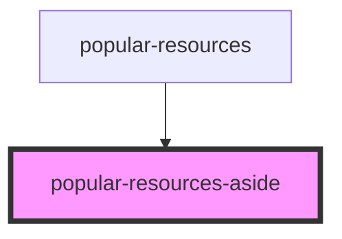

# popular-resources-aside

<!-- Auto Generated Below -->

## Properties

| Property       | Attribute | Description | Type    | Default     |
| -------------- | --------- | ----------- | ------- | ----------- |
| `popularAside` | --        |             | `any[]` | `undefined` |

## Dependencies

### Used by

 - [popular-resources](../../../../../../../../../..)

### Graph

----------------------------------------------

*Built with [StencilJS](https://stenciljs.com/)*
