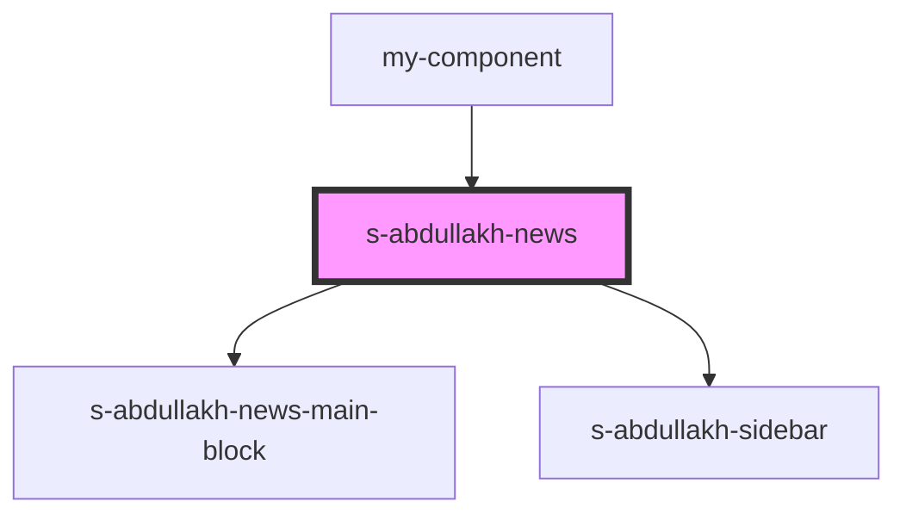

# news-a

<!-- Auto Generated Below -->

## Properties

| Property  | Attribute  | Description                    | Type     | Default     |
| --------- | ---------- | ------------------------------ | -------- | ----------- |
| `news`    | --         | массив news-main-block         | `any[]`  | `undefined` |
| `newsImg` | `news-img` | ссылка на изображение логотипа | `string` | `undefined` |
| `sidebar` | --         | массив Sidebar                 | `any[]`  | `undefined` |

## Events

| Event         | Description                      | Type               |
| ------------- | -------------------------------- | ------------------ |
| `clickOnNews` | клик по кнопке в компоненте news | `CustomEvent<any>` |

## Dependencies

### Used by

 - [my-component](../../../../my-component)

### Depends on

- [s-abdullakh-news-main-block](./res/view/s-abdullakh-news-main-block)
- [s-abdullakh-sidebar](./res/view/s-abdullakh-sidebar)

### Graph

----------------------------------------------

*Built with [StencilJS](https://stenciljs.com/)*
