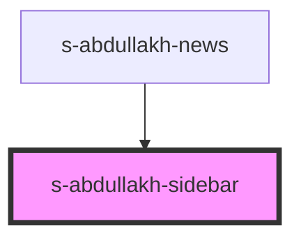

# sidebar-a

<!-- Auto Generated Below -->

## Properties

| Property | Attribute | Description              | Type  | Default     |
| -------- | --------- | ------------------------ | ----- | ----------- |
| `arr`    | `arr`     | массив элементов Sidebar | `any` | `undefined` |

## Events

| Event         | Description                      | Type               |
| ------------- | -------------------------------- | ------------------ |
| `clickOnNews` | клик по кнопке в компоненте news | `CustomEvent<any>` |

## Dependencies

### Used by

 - [s-abdullakh-news](../../..)

### Graph

----------------------------------------------

*Built with [StencilJS](https://stenciljs.com/)*
