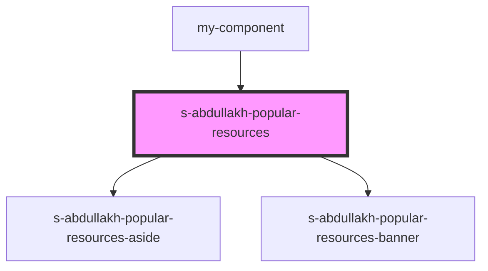

# popular-resources

<!-- Auto Generated Below -->

## Properties

| Property            | Attribute             | Description                                                                   | Type     | Default     |
| ------------------- | --------------------- | ----------------------------------------------------------------------------- | -------- | ----------- |
| `popularAside`      | --                    | массив для блоков компонента s-abdullakh-s-abdullakh-popular-resources-aside  | `any[]`  | `undefined` |
| `popularAsideTitle` | `popular-aside-title` | массив для блоков компонента s-abdullakh-s-abdullakh-popular-resources-aside  | `string` | `undefined` |
| `popularBanner`     | --                    | массив для блоков компонента s-abdullakh-s-abdullakh-popular-resources-banner | `any[]`  | `undefined` |

## Events

| Event            | Description                                      | Type               |
| ---------------- | ------------------------------------------------ | ------------------ |
| `clickOnPopular` | клик по компоненту s-abdullakh-popular-resources | `CustomEvent<any>` |

## Dependencies

### Used by

 - [my-component](../../../../my-component)

### Depends on

- [s-abdullakh-popular-resources-aside](./res/view/s-abdullakh-popular-resources-aside)
- [s-abdullakh-popular-resources-banner](./res/view/s-abdullakh-popular-resources-banner)

### Graph

----------------------------------------------

*Built with [StencilJS](https://stenciljs.com/)*
