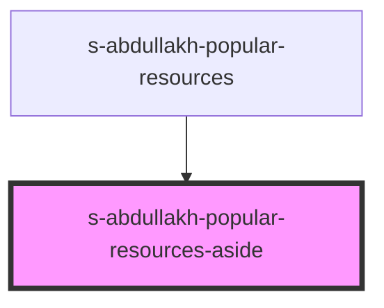

# popular-resources-aside

<!-- Auto Generated Below -->

## Properties

| Property | Attribute | Description                                                                  | Type  | Default     |
| -------- | --------- | ---------------------------------------------------------------------------- | ----- | ----------- |
| `arr`    | `arr`     | массив для блоков компонента s-abdullakh-s-abdullakh-popular-resources-aside | `any` | `undefined` |

## Events

| Event            | Description                                                                                         | Type               |
| ---------------- | --------------------------------------------------------------------------------------------------- | ------------------ |
| `clickOnPopular` | клик по компоненту  s-abdullakh-s-abdullakh-popular-resources-aside в s-abdullakh-popular-resources | `CustomEvent<any>` |

## Dependencies

### Used by

 - [s-abdullakh-popular-resources](../../..)

### Graph

----------------------------------------------

*Built with [StencilJS](https://stenciljs.com/)*
