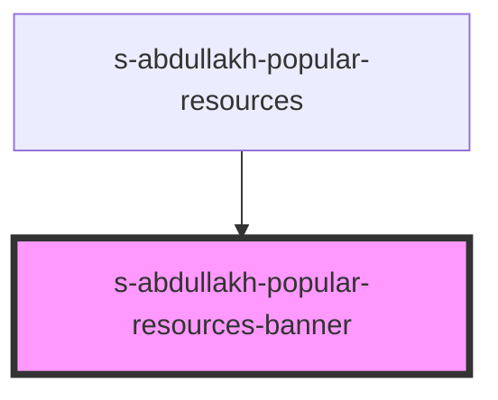

# popular-resources-banner

<!-- Auto Generated Below -->

## Properties

| Property            | Attribute             | Description                                                                   | Type     | Default     |
| ------------------- | --------------------- | ----------------------------------------------------------------------------- | -------- | ----------- |
| `arr`               | `arr`                 | массив для блоков компонента s-abdullakh-s-abdullakh-popular-resources-banner | `any`    | `undefined` |
| `popularAsideTitle` | `popular-aside-title` | массив для блоков компонента s-abdullakh-s-abdullakh-popular-resources-aside  | `string` | `undefined` |

## Events

| Event            | Description                                                                          | Type               |
| ---------------- | ------------------------------------------------------------------------------------ | ------------------ |
| `clickOnAside`   | клик по кнопке Read Report в Sidebar                                                 | `CustomEvent<any>` |
| `clickOnPopular` | клик по компоненту  s-abdullakh-s-abdullakh-popular-resources-aside в popular-banner | `CustomEvent<any>` |

## Dependencies

### Used by

 - [s-abdullakh-popular-resources](../../..)

### Graph

----------------------------------------------

*Built with [StencilJS](https://stenciljs.com/)*
